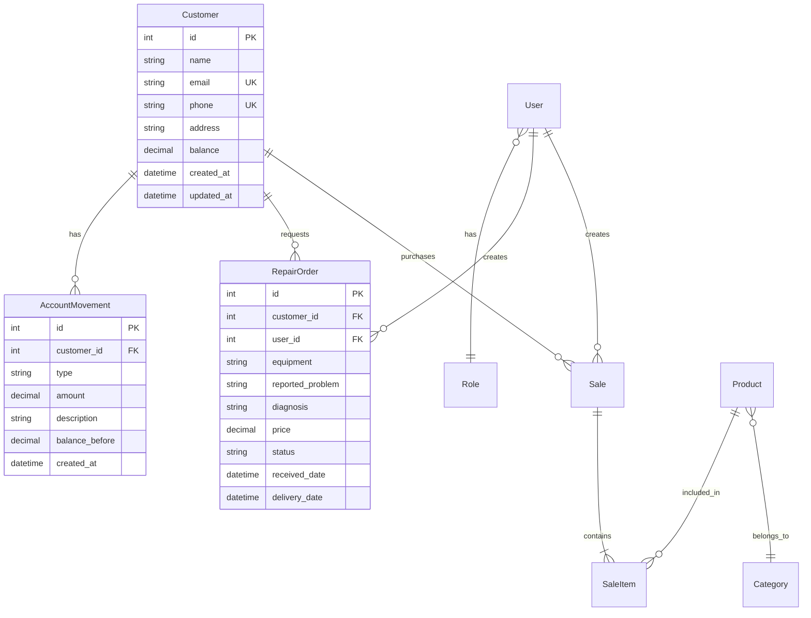

# TechStore SaaS - Enhanced Architecture Documentation

## Document Information
- **Version**: 2.0
- **Date**: July 27, 2025
- **Status**: Aligned with PRD v1.0
- **Purpose**: Technical architecture blueprint for TechStore SaaS implementation

## Table of Contents
1. [Architecture Overview](#architecture-overview)
2. [System Architecture](#system-architecture)
3. [Data Architecture](#data-architecture)
4. [Security Architecture](#security-architecture)
5. [Deployment Architecture](#deployment-architecture)
6. [Development Standards](#development-standards)
7. [Architecture Decision Records](#architecture-decision-records)

---

## Architecture Overview

TechStore SaaS follows a **pragmatic, monolithic architecture** designed for rapid development and easy deployment while maintaining the flexibility to evolve into microservices if needed.

### Core Principles
1. **Simplicity First**: Start simple, evolve as needed
2. **Developer Experience**: Fast feedback loops, clear structure
3. **Business Alignment**: Architecture serves business goals
4. **Progressive Enhancement**: Web-first with enhanced interactivity
5. **Test-Driven**: Architecture supports TDD workflow

### High-Level Architecture

```
┌─────────────────────────────────────────────────────┐
│                   Load Balancer                      │
│                    (Railway)                         │
└──────────────────────┬──────────────────────────────┘
                       │
┌──────────────────────▼──────────────────────────────┐
│                FastAPI Application                   │
│  ┌────────────────────────────────────────────┐     │
│  │            Middleware Layer                 │     │
│  │  (CORS, Auth, Logging, Error Handling)     │     │
│  └────────────────────┬───────────────────────┘     │
│                       │                              │
│  ┌────────────────────┼───────────────────────┐     │
│  │     Web Layer      │      API Layer        │     │
│  │  (HTMX + Jinja2)   │   (REST + JSON)       │     │
│  └────────────────────┴───────────────────────┘     │
│                       │                              │
│  ┌────────────────────▼───────────────────────┐     │
│  │              Service Layer                  │     │
│  │         (Business Logic & Rules)            │     │
│  └────────────────────┬───────────────────────┘     │
│                       │                              │
│  ┌────────────────────▼───────────────────────┐     │
│  │            Repository Layer                 │     │
│  │          (CRUD Operations)                  │     │
│  └────────────────────┬───────────────────────┘     │
└──────────────────────┬──────────────────────────────┘
                       │
┌──────────────────────▼──────────────────────────────┐
│                  PostgreSQL Database                 │
│              (Managed by Railway)                    │
└─────────────────────────────────────────────────────┘
```

---

## System Architecture

### 1. Presentation Layer

#### Web Interface (HTMX)
- **Technology**: HTMX + Jinja2 Templates + Tailwind CSS
- **Purpose**: Primary user interface for business users
- **Pattern**: Server-side rendering with progressive enhancement
- **Benefits**: 
  - Fast initial page loads
  - SEO friendly
  - Works without JavaScript
  - Reduced complexity

#### API Interface (REST)
- **Technology**: FastAPI with automatic OpenAPI documentation
- **Purpose**: Future mobile apps, integrations
- **Pattern**: RESTful design with consistent conventions
- **Benefits**:
  - Machine-readable contracts
  - Easy third-party integration
  - Testability

### 2. Application Layer

#### Service Layer Architecture
```python
# Example Service Pattern
class CustomerService:
    def __init__(self, customer_repo: CustomerRepository):
        self.repo = customer_repo
    
    def create_customer(self, customer_data: CustomerCreate) -> Customer:
        # Business validation
        if self.repo.exists_by_email(customer_data.email):
            raise DuplicateCustomerError()
        
        # Create with initial balance
        customer = Customer(**customer_data.dict(), balance=Decimal(0))
        return self.repo.create(customer)
    
    def update_balance(self, customer_id: int, amount: Decimal, description: str):
        # Business rule: Track all balance changes
        customer = self.repo.get(customer_id)
        movement = AccountMovement(
            customer_id=customer_id,
            amount=amount,
            description=description,
            balance_before=customer.balance
        )
        customer.balance += amount
        self.repo.update(customer)
        self.repo.create_movement(movement)
```

#### Key Services
1. **AuthService**: User authentication and authorization
2. **CustomerService**: Customer management and account operations
3. **ProductService**: Inventory and catalog management
4. **SalesService**: Sales transactions and processing
5. **RepairService**: Repair order workflow management

### 3. Data Access Layer

#### Repository Pattern Implementation
```python
# Base Repository
class BaseRepository(Generic[ModelType, CreateSchemaType, UpdateSchemaType]):
    def __init__(self, model: Type[ModelType]):
        self.model = model
    
    def get(self, db: Session, id: int) -> Optional[ModelType]:
        return db.query(self.model).filter(self.model.id == id).first()
    
    def get_multi(self, db: Session, *, skip: int = 0, limit: int = 100):
        return db.query(self.model).offset(skip).limit(limit).all()
    
    def create(self, db: Session, *, obj_in: CreateSchemaType) -> ModelType:
        db_obj = self.model(**obj_in.dict())
        db.add(db_obj)
        db.commit()
        db.refresh(db_obj)
        return db_obj
```

---

## Data Architecture

### Entity Relationship Diagram



### Database Design Principles

1. **Normalization**: 3NF for transactional data
2. **Audit Trail**: All financial movements tracked
3. **Soft Deletes**: Logical deletion for compliance
4. **Timestamps**: Created/updated on all entities
5. **Constraints**: Foreign keys, unique constraints enforced

### Migration Strategy

```bash
# Create new migration
poetry run alembic revision --autogenerate -m "Add customer tables"

# Apply migrations
poetry run alembic upgrade head

# Rollback if needed
poetry run alembic downgrade -1
```

---

## Security Architecture

### Authentication & Authorization

#### JWT Token Flow
```
┌──────────┐     ┌──────────┐     ┌──────────┐
│  Client  │────▶│   API    │────▶│   Auth   │
│          │     │ Gateway  │     │ Service  │
└──────────┘     └──────────┘     └──────────┘
     │                 │                 │
     │   1. Login      │                 │
     │────────────────▶│   2. Validate   │
     │                 │────────────────▶│
     │                 │                 │
     │                 │   3. Generate   │
     │   4. JWT Token  │◀────────────────│
     │◀────────────────│                 │
     │                 │                 │
     │   5. Request    │                 │
     │   + JWT Token   │                 │
     │────────────────▶│   6. Verify     │
     │                 │────────────────▶│
     │                 │                 │
     │   7. Response   │                 │
     │◀────────────────│                 │
```

### Security Layers

1. **Transport Security**
   - HTTPS enforced in production
   - HSTS headers
   - Secure cookie flags

2. **Application Security**
   - Input validation (Pydantic)
   - SQL injection prevention (SQLAlchemy)
   - XSS prevention (Jinja2 auto-escape)
   - CSRF protection (SameSite cookies)

3. **Data Security**
   - Passwords hashed with bcrypt
   - Sensitive data encrypted at rest
   - PII handling compliance

4. **Access Control**
   - Role-based permissions (Admin, User)
   - Resource-level authorization
   - API rate limiting

---

## Deployment Architecture

### Production Environment (Railway)

```yaml
# railway.yaml
services:
  web:
    build:
      dockerfile: Dockerfile
    environment:
      - DATABASE_URL=${{Postgres.DATABASE_URL}}
      - SECRET_KEY=${{shared.SECRET_KEY}}
      - ENVIRONMENT=production
    healthcheck:
      path: /health
      interval: 30s
    
  postgres:
    image: postgres:15
    volumes:
      - postgres_data:/var/lib/postgresql/data
    environment:
      - POSTGRES_DB=techstore
      - POSTGRES_USER=${{shared.DB_USER}}
      - POSTGRES_PASSWORD=${{shared.DB_PASSWORD}}
```

### Scaling Strategy

1. **Vertical Scaling**: Initial approach via Railway
2. **Horizontal Scaling**: Multiple app instances behind load balancer
3. **Database Scaling**: Read replicas for reporting
4. **Caching Layer**: Redis for sessions and frequent queries (future)

### Monitoring & Observability

```python
# Structured Logging
import structlog

logger = structlog.get_logger()

@app.middleware("http")
async def log_requests(request: Request, call_next):
    request_id = str(uuid.uuid4())
    with structlog.contextvars.bind_contextvars(request_id=request_id):
        start_time = time.time()
        response = await call_next(request)
        process_time = time.time() - start_time
        
        logger.info(
            "request_processed",
            method=request.method,
            path=request.url.path,
            status_code=response.status_code,
            process_time=process_time
        )
        
        return response
```

---

## Development Standards

### Code Organization

```
src/app/
├── __init__.py
├── main.py              # FastAPI app initialization
├── config.py            # Settings management
├── database.py          # Database configuration
├── dependencies.py      # Dependency injection
│
├── models/              # SQLAlchemy models
│   ├── __init__.py
│   ├── base.py         # Base model with common fields
│   ├── auth.py         # User, Role models
│   ├── customer.py     # Customer, AccountMovement
│   ├── product.py      # Product, Category
│   ├── sale.py         # Sale, SaleItem
│   └── repair.py       # RepairOrder
│
├── schemas/            # Pydantic schemas
│   ├── __init__.py
│   └── [matching structure to models]
│
├── services/           # Business logic layer
│   ├── __init__.py
│   ├── auth.py
│   ├── customer.py
│   ├── product.py
│   ├── sale.py
│   └── repair.py
│
├── api/v1/            # REST API endpoints
│   ├── __init__.py
│   ├── router.py      # API router aggregation
│   └── endpoints/
│       └── [module endpoints]
│
├── web/               # HTMX web interface
│   ├── __init__.py
│   ├── router.py      # Web router aggregation
│   └── views/
│       └── [module views]
│
└── templates/         # Jinja2 templates
    ├── layout/
    ├── components/
    └── pages/
```

### Testing Strategy

#### Test Pyramid
```
         /\
        /  \    E2E Tests (10%)
       /────\   - Critical user journeys
      /      \  - Browser automation
     /────────\ 
    /          \ Integration Tests (30%)
   /            \- API endpoint tests
  /──────────────\- Database operations
 /                \
/──────────────────\ Unit Tests (60%)
                     - Service logic
                     - Model validation
                     - Utility functions
```

#### TDD Workflow Implementation
```python
# 1. RED - Write failing test
def test_create_customer_with_duplicate_email(customer_service, existing_customer):
    with pytest.raises(DuplicateCustomerError):
        customer_service.create_customer(
            CustomerCreate(email=existing_customer.email, name="New")
        )

# 2. GREEN - Implement minimum code
def create_customer(self, customer_data: CustomerCreate):
    if self.repo.exists_by_email(customer_data.email):
        raise DuplicateCustomerError()
    return self.repo.create(customer_data)

# 3. REFACTOR - Improve implementation
def create_customer(self, customer_data: CustomerCreate):
    # Validate business rules
    self._validate_unique_email(customer_data.email)
    self._validate_unique_phone(customer_data.phone)
    
    # Create with defaults
    customer = self._create_with_defaults(customer_data)
    
    # Trigger events
    self._emit_customer_created_event(customer)
    
    return customer
```

---

## Architecture Decision Records

### ADR-001: Monolithic Architecture
**Status**: Accepted  
**Context**: Need to balance development speed with future scalability  
**Decision**: Start with modular monolith, prepare for microservices  
**Consequences**: Faster initial development, delayed complexity

### ADR-002: HTMX for Primary UI
**Status**: Accepted  
**Context**: Target users prefer familiar web interfaces  
**Decision**: Use HTMX for progressive enhancement  
**Consequences**: Simpler stack, better SEO, limited offline capability

### ADR-003: Repository Pattern
**Status**: Accepted  
**Context**: Need abstraction between business logic and data access  
**Decision**: Implement repository pattern for all entities  
**Consequences**: Testable services, swappable data stores, some boilerplate

### ADR-004: JWT for Authentication
**Status**: Accepted  
**Context**: Need stateless authentication for API scalability  
**Decision**: Use JWT tokens with refresh token rotation  
**Consequences**: Horizontal scaling ready, complex token management

### ADR-005: Feature Flags (Future)
**Status**: Proposed  
**Context**: Need to control feature rollout and A/B testing  
**Decision**: Implement feature flag system  
**Consequences**: Gradual rollouts, increased complexity

---

## Performance Considerations

### Query Optimization
```python
# Eager loading for N+1 prevention
def get_customer_with_movements(self, db: Session, customer_id: int):
    return db.query(Customer)\
        .options(selectinload(Customer.movements))\
        .filter(Customer.id == customer_id)\
        .first()
```

### Caching Strategy (Future)
```python
# Redis caching decorator
@cache(expire=300)  # 5 minutes
def get_product_catalog(self, category_id: Optional[int] = None):
    return self.repo.get_by_category(category_id)
```

### Database Indexing
```sql
-- Performance indexes
CREATE INDEX idx_customer_email ON customers(email);
CREATE INDEX idx_customer_phone ON customers(phone);
CREATE INDEX idx_sale_customer_date ON sales(customer_id, created_at);
CREATE INDEX idx_repair_status ON repair_orders(status);
CREATE INDEX idx_product_sku ON products(sku);
```

---

## Conclusion

This architecture provides a solid foundation for TechStore SaaS that:
- Aligns with business requirements
- Supports rapid development
- Scales with growth
- Maintains simplicity
- Enables future evolution

The key is to start simple, measure everything, and evolve based on real needs rather than anticipated ones.